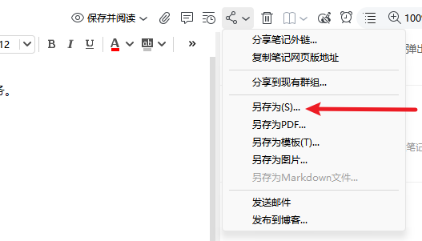
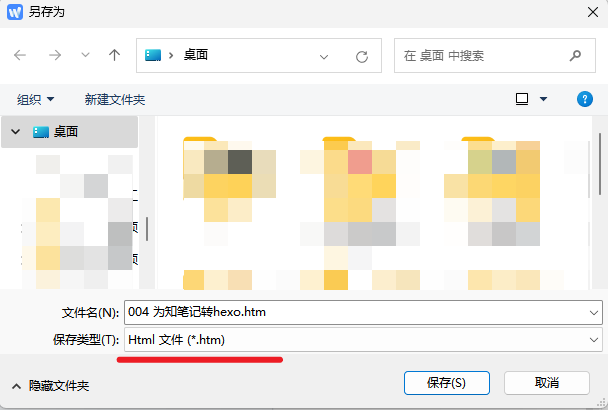
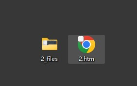
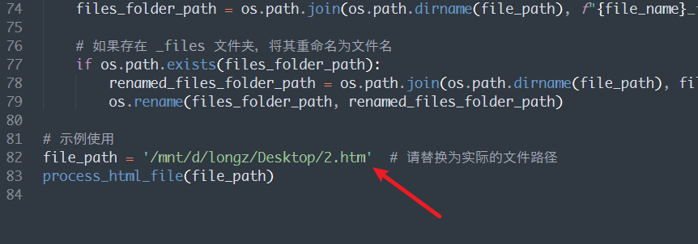

# wiznote2hexo
**为知笔记转hexo**
最近把为知笔记同步到hexo博客中，今天写了一个非常简单的脚本帮助我完成迁移任务。

## 依赖环境
- Python3
- bs4库：安装方式 `pip install beautifulsoup4`
- hashlib库：安装方式 `pip install hashlib`

## 使用方式：
把笔记另存为 htm格式：

此时会有2个文件夹：

## 运行脚本
**修改file_path的路径**

**运行脚本：**

得到一个同名的md文件，把md文件、文件夹一起复制到hexo的source文件夹中，就可以了。

